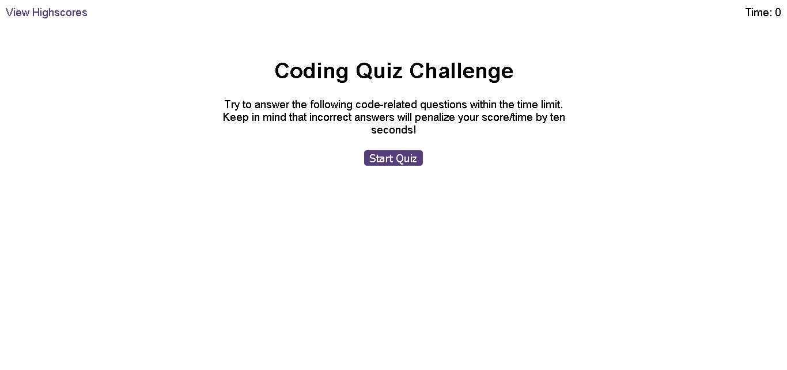

# Code Quiz

## Description

This app works with Web API.
You can take the multiple-choice coding quiz in this app. 
The app can keep track of high scores and quiz-takers' initials.

## Usage

You can play the "Quiz Game"

- Visit the page in: https://zamanpour.github.io/Code-Quiz/
- It show same as:

## Features

- To start the test, click on the start button to start the timer.
- After registering the answer, the next question will appear automatically.
- Based on the recorded correct or incorrect answer, the sound effect will be played.
- If the answer is wrong, 10 seconds will be deducted from the time.
- The game ends when all the questions are answered or the time reaches zero.
- At the end, after viewing your score, you can enter the abbreviation of your initial to register your score.
- You can see the previous scores with initial of players in order from the highest to the lowest recorded score on the Highscores page.